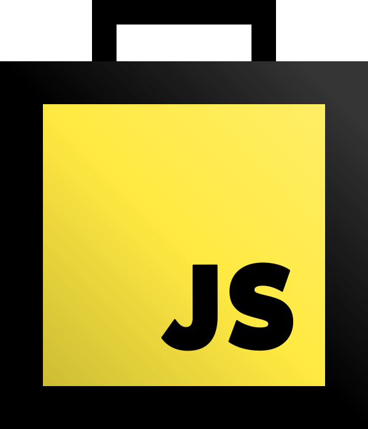

<a href="//github.com/borela-tech/toolbox">
  
</a>

[][watchers]
[][stars]
[][issues]
[][pulls]
[][forks]

CLI tool to simplify the development of JavaScript apps/libraries with little to
no configuration.

## Table of contents

1. [What’s included](#whats-included)
2. [Installation](#installation)
3. [Creating a simple JS library](#creating-a-simple-js-library)
4. [Creating an Express server](#Creating-an-express-server)
5. [Creating a Single Page React Application](#creating-a-single-page-react-application)
6. [Commands](#commands)
7. [Available templates](#available-templates)

## What’s included

* All [Babel’s experimental plugins][experimental-plugins] are enabled by
  default;
* Polyfills are included based on the browsers and minimum NodeJS version
  supported by your project;
* This tool can be installed globally and used to compile any project that
  follows the expected directory structure;
* Your project will have little to no development dependencies;

Some features must be enabled explicitly either through command flags or
configuration:

* [Flow][flow];
* [React][react];
* [JSX][jsx];
* [TypeScript][typescript];

## Installation

```sh
npm install @borela-tech/js-toolbox -g
```

## Creating a simple JS library

1. Navigate to the directory you want to create the project;
2. Run the command `bb scaffold lib`;

Run the tests:

```sh
bb test

# Or in watch mode.
bb test --watch
```

Lint the sources and tests:

```sh
bb lint

# ESLint will try to fix linting errors but be aware that not all of them can
# be fixed automatically.
bb lint --fix
```

And finally, to build:

```sh
bb build

# The previous command includes a lot of stuff that’s only needed during
# development, to build without them, run:
bb build --production
```

## Creating an [Express][express] server

1. Navigate to the directory you want to create the project;
2. Run the command `bb scaffold express`;

The commands to *test*, *lint* and *build* are the same but this time, you can
also:

```sh
bb nodemon
```

This command will start the server using [nodemon][nodemon] and any changes to
the files will make [nodemon][nodemon] restart the server.

## Creating a Single Page [React][react] Application

1. Navigate to the directory you want to create the project;
2. Run the command `bb scaffold react/spa`;

The commands to *test*, *lint* and *build* are the same but this time, you can
also:

```sh
bb serve
```

This command will spin up [Webpack’s Development Server][webpack-dev-server] to
serve your application on `localhost:9000`. Features included:

* [React Hot Loader][react-hot-loader] to enable hot reload of react components
  without losing state;
* [RedBox][red-box-react] to make error messages pretty;

## Commands

#### build

```sh
bb build
```

Compile the files using [Babel][babel] and put them in the build directory. If
the project type requires bundling, [Webpack][webpack] will be used.

#### scaffold

```sh
bb scaffold <template> [destination]
```

Copy the template files to the current folder or the destination specified.

#### lint

```sh
bb lint
```

Run [ESLint][eslint] on the sources and tests separately to make sure that
[Jest’s globals][jest-globals] only affect the tests.

#### [nodemon][nodemon]

```sh
bb nodemon
```

Run the main script using [nodemon][nodemon].

#### serve

```sh
bb serve
```

Serve a application using [Webpack’s Development Server][webpack-dev-server].

#### test

```sh
bb test
```

Run [Jest][jest].

## Available templates

The templates included in the toolbox are:

* `express`: Simple server using [Express][express];
* `lib`: Simple JS library;
* `react/spa`: Single Page React application;
* `yargs`: CLI using [Yargs][yargs];

[forks]: //github.com/borela-tech/toolbox/network/members
[issues]: //github.com/borela-tech/toolbox/issues
[pulls]: //github.com/borela-tech/toolbox/pulls
[stars]: //github.com/borela-tech/toolbox/stargazers
[watchers]: //github.com/borela-tech/toolbox/watchers

[babel]: //babeljs.io
[eslint]: //eslint.org
[express]: //expressjs.com/
[flow]: //flow.org
[jest]: //jestjs.io
[jsx]: //facebook.github.io/jsx/
[nodemon]: //nodemon.io
[react-hot-loader]: //github.com/gaearon/react-hot-loader
[react]: //reactjs.org
[red-box-react]: //github.com/commissure/redbox-react
[toolbox]: //github.com/borela-tech/toolbox
[typescript]: //www.typescriptlang.org
[webpack]: //webpack.js.org
[yargs]: //yargs.js.org

[experimental-plugins]: //babeljs.io/docs/en/plugins#experimental
[jest-globals]: //jestjs.io/docs/en/api
[preset-env]: //babeljs.io/docs/en/next/babel-preset-env.html
[webpack-dev-server]: //webpack.js.org/configuration/dev-server/
