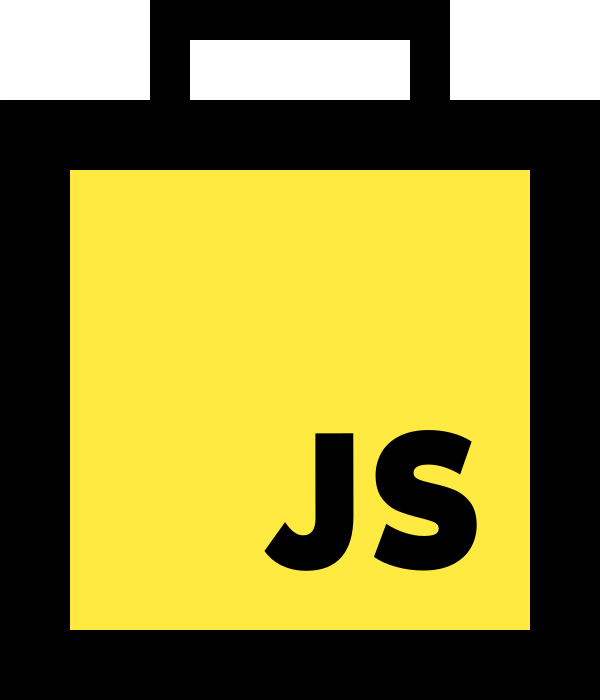

<a href="//github.com/borela-tech/js-toolbox">
  
</a>

[][watchers]
[][stars]
[][issues]
[][pulls]
[][forks]

[][travis-build]
[][appveyor-build]
[][nodejs]
[][toolbox]
[][toolbox]

CLI tool to simplify the development of JavaScript apps/libraries with little to
no configuration.

## Table of contents

1. [What’s included](#whats-included)
2. [Installation](#installation)
3. [Creating a simple JS library](#creating-a-simple-js-library)
4. [Creating an Express server](#Creating-an-express-server)
5. [Creating a Single Page React Application](#creating-a-single-page-react-application)
6. [Command flag vs config file](#command-flag-vs-config-file)
7. [Commands](#commands)
   1. [build](#build)
   2. [scaffold](#scaffold)
   3. [lint](#lint)
   4. [nodemon](#nodemon)
   5. [serve](#serve)
   6. [test](#test)

## What’s included

* All [Babel’s experimental plugins][experimental-plugins] are enabled by
  default;
* Polyfills are included based on the browsers and minimum NodeJS version
  supported by your project;
* This tool can be installed globally and used to compile any project that
  follows the expected directory structure;
* Your project will have little to no development dependencies;

Some features must be enabled explicitly either through command flags or
configuration:

* [Flow][flow];
* [React][react];
* [JSX][jsx];
* [TypeScript][typescript];

## Installation

```sh
npm install @borela-tech/js-toolbox -g
```

## Creating a simple JS library

1. Navigate to the directory you want to create the project;
2. Run the command `bb scaffold lib`;

Run the tests:

```sh
bb test

# Or in watch mode.
bb test --watch
```

Lint the sources and tests:

```sh
bb lint

# ESLint will try to fix linting errors but be aware that not all of them can
# be fixed automatically.
bb lint --fix
```

And finally, to build:

```sh
bb build

# The previous command includes a lot of stuff that’s only needed during
# development, to build without them, run:
bb build --production
```

## Creating an [Express][express] server

1. Navigate to the directory you want to create the project;
2. Run the command `bb scaffold express`;

The commands to *test*, *lint* and *build* are the same but this time, you can
also:

```sh
bb nodemon
```

This command will start the server using [nodemon][nodemon] and any changes to
the files will make nodemon restart the server.

## Creating a Single Page [React][react] Application

1. Navigate to the directory you want to create the project;
2. Run the command `bb scaffold react/spa`;

The commands to *test*, *lint* and *build* are the same but this time, you can
also:

```sh
bb serve
```

This command will spin up [Webpack’s Development Server][webpack-dev-server] to
serve your application on `localhost:9000`. Features included:

* [React Hot Loader][react-hot-loader] to enable hot reload of react components
  without losing state;
* [RedBox][red-box-react] to make error messages pretty;

## Command flag vs config file

You can control the commands behavior either through flags or configuration
files, for example, if you want to enable JSX transformation on the *build* and
*test* commands, you pass the flag directly to them:

```sh
bb build --jsx
bb test --jsx
```

Alternatively, you can add a `borela` section to your `package.json` like so:

```json
{
  "name": "awesome-package",
  "version": "1.0.0",
  "description": "Some awesome package.",
  "borela": {
    "jsx": true
  }
}
```

Or create a `borela.json` at the root of your package:

```json
{
  "jsx": true
}
```

The same logic can be applied to all command flags.

## Commands

### build

```sh
bb build
```

Compile the files using [Babel][babel] and put them in the build directory. If
the project type requires bundling, [Webpack][webpack] will be used.

Feature flags:

* `-j, --jsx`: Enable JSX;
* `-r, --react`: Enable React;
* `-t, --type-script`: Enable TypeScript;

Transformation flags:

* `--comment-flow`: Transform Flow annotations into comment blocks;
* `--remove-flow`: Remove all Flow annotations.

Polyfill flags:

* `--browsers`¹: Supported browsers;
* `--node`¹: Minimum supported NodeJS version;
* `--platforms`: Controls the polyfills and it is used to determine if multiple
  build outputs are necessary based on the platforms specified;

¹ The polyfill flags `browsers` and `node` are passed directly to
[@babel/preset-env][preset-env], you can find more information of the accepted
values on its documentation.

### scaffold

```sh
bb scaffold <template> [destination]
```

Copy the template files to the current folder or the destination specified. The
templates included in the toolbox are:

* `express`: Simple server using [Express][express];
* `lib`: Simple JS library;
* `react/spa`: Single Page React application;
* `yargs`: CLI using [Yargs][yargs];

### lint

```sh
bb lint
```

Run [ESLint][eslint] on the sources and tests separately to make sure that
[Jest’s globals][jest-globals] only affect the tests.

### nodemon

```sh
bb nodemon
```

Run the main script using [nodemon][nodemon].

### serve

```sh
bb serve
```

Serve a application using [Webpack’s Development Server][webpack-dev-server].

### test

```sh
bb test
```

Run [Jest][jest].

[forks]: //github.com/borela-tech/js-toolbox/network/members
[issues]: //github.com/borela-tech/js-toolbox/issues
[pulls]: //github.com/borela-tech/js-toolbox/pulls
[stars]: //github.com/borela-tech/js-toolbox/stargazers
[watchers]: //github.com/borela-tech/js-toolbox/watchers

[babel]: //babeljs.io
[eslint]: //eslint.org
[express]: //expressjs.com/
[flow]: //flow.org
[jest]: //jestjs.io
[jsx]: //facebook.github.io/jsx/
[nodemon]: //nodemon.io
[nodejs]: //nodejs.org
[react-hot-loader]: //github.com/gaearon/react-hot-loader
[react]: //reactjs.org
[red-box-react]: //github.com/commissure/redbox-react
[toolbox]: //github.com/borela-tech/js-toolbox
[typescript]: //www.typescriptlang.org
[webpack]: //webpack.js.org
[yargs]: //yargs.js.org

[appveyor-build]: //ci.appveyor.com/project/borela/js-toolbox
[experimental-plugins]: //babeljs.io/docs/en/plugins#experimental
[jest-globals]: //jestjs.io/docs/en/api
[preset-env]: //babeljs.io/docs/en/next/babel-preset-env.html
[travis-build]: //travis-ci.org/borela-tech/js-toolbox
[webpack-dev-server]: //webpack.js.org/configuration/dev-server/
